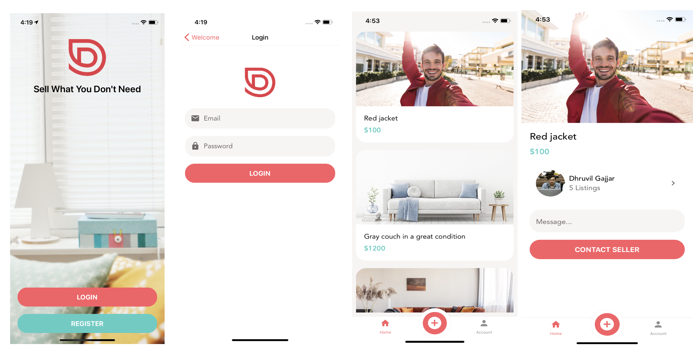

# pinterest
Basic shopping application build in react native

  

        
  

  

# How to Run App

  1. clone this repository  
  2. open cmd/terminal to clone repository folder  
  3. run `npm install` **on windows** or `sudo npm install` **on ios/linux**  
  4. run `npm start`

